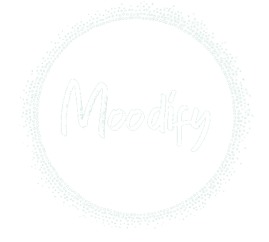

# Moodify

    

## What is Moodify?

Moodify is a comprehensive web application designed to support and help users along their mental health journey. In response to the rising mental health conditions such as depression and anxiety, as reported by the World Health Organization in 2022, the Virtual Visionaries ideated this platform to assist users in documenting their thoughts and seek professional help as needed. The application harnesses the power of Machine Learning and Artificial Intelligence, MongoDB, and Google Cloud Platforms to provide an inclusive solution for mental health improvement.

## Try Moodify for yourself!

Head over to our website [here!](#)

## Features

Moodify offers four main features centered around the concept of journaling, a practice proven to alleviate symptoms of depression and anxiety according to Smyth et al. (2018).

- **Track Your Mood**: A feature that allows users to freely express their thoughts without fear of judgment. This feature uses a calendar flipbook style for users to document their feelings. The input is processed by our ML model, deployed using the Google Cloud Run service, to classify the emotion of the text. A therapist is notified of the user's emotions, and the system keeps a streak count to alert a user's therapist and/or emergency contact if journaling is neglected for a worryingly long period.

- **Grateful**: Users are prompted to list things they are grateful for each day, encouraging positive emotions and mental resilience.

- **Video Consult**: This feature facilitates quick and easy consultation with therapists from the comfort of one's home, easing the anxiety around seeking professional help.

- **Resources**: Moodify consolidates valuable resources on mental health management in one convenient place.

Please note that these are not the final features; our team has future plans to develop Moodify into a mobile application, include gamification for better engagement, add a chat feature, improve the SOS notification system, fully integrate the video calling function, and offer randomised motivational and inspirational messages.

## Tech Stack

    <code></code>
    <code></code>
    <code></code>
    <code></code>
    <code></code>

## Challenges and Accomplishments

Our main challenge was to ideate features that would integrate well together to achieve our goal of improving our user's mental health holistically. We are proud of integrating Google Cloud Platforms into our application and of this meaningful project that solves a pertinent problem.

## Collaborators

[Dilys Pang](https://github.com/Dilysss) 
[Kavan Tan](https://github.com/kavantan) 
[Kevin Eyo](https://github.com/KevinEyo1) 
[Merrick Neo](https://github.com/Merrickneo)
